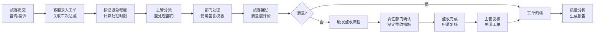

## 1. 产品概述

铁路旅客服务质量综合管理平台，面向客服中心和车站服务管理人员，实现旅客咨询、投诉的全流程跟踪管理与服务质量分析提升。

- 核心目标：建立标准化工单处理流程，实现服务质量可追溯、可分析、可改进
- 目标用户：客服中心坐席、车站服务管理人员、质量分析人员、部门负责人

## 2. 核心功能

### 2.1 用户角色

| 角色 | 注册方式 | 核心权限 |
|------|----------|----------|
| 客服坐席 | 系统账号 | 工单受理、录入、分派、答复模板使用 |
| 服务主管 | 系统账号 | 工单审核、责任部门确认、整改跟踪 |
| 质量分析员 | 系统账号 | 质量报告生成、热点问题分析、数据统计 |
| 部门负责人 | 系统账号 | 整改任务接收、处理反馈、复核关闭 |

### 2.2 功能模块

1. **工单总览**：热线/网页工单统计概览、实时状态监控、关键指标看板
2. **渠道接入**：多渠道工单录入、车次站点关联、紧急程度标记、附件上传
3. **工单处理**：工单分派、处理时限提醒、答复模板、处理记录留存
4. **旅客回访**：满意度回访记录、重复投诉识别、回访结果统计
5. **服务标准**：服务标准查询、知识库管理、标准条款检索
6. **整改跟踪**：责任部门确认、整改任务下发、复核关闭流程
7. **质量分析**：热点问题排行、月度质量报告、趋势分析图表

### 2.3 页面详情

| 页面名称 | 模块名称 | 功能描述 |
|----------|----------|----------|
| 工单总览 | 数据看板 | 工单总量、处理率、满意度等核心指标卡片 |
| 工单总览 | 趋势图表 | 近7/30天工单数量趋势折线图 |
| 工单总览 | 工单列表 | 最新工单快捷查看、状态筛选 |
| 渠道接入 | 工单录入 | 热线/网页渠道工单新增表单 |
| 渠道接入 | 信息关联 | 车次选择、站点选择、问题分类下拉 |
| 渠道接入 | 紧急标记 | 紧急程度等级选择、时限自动计算 |
| 工单处理 | 工单列表 | 待处理/处理中/已完成工单分页列表 |
| 工单处理 | 分派操作 | 工单分派给指定人员或部门 |
| 工单处理 | 答复模板 | 常用答复模板选择、内容编辑 |
| 旅客回访 | 回访记录 | 回访列表、回访结果录入 |
| 旅客回访 | 重复识别 | 相同旅客/相同问题自动标记 |
| 旅客回访 | 满意度统计 | 各维度满意度占比图表 |
| 服务标准 | 标准分类 | 服务标准目录树、分类浏览 |
| 服务标准 | 标准详情 | 标准条款展示、搜索高亮 |
| 服务标准 | 知识库 | 常见问题解答、处理指引 |
| 整改跟踪 | 整改任务 | 待整改/整改中/已复核任务列表 |
| 整改跟踪 | 责任确认 | 部门认领、责任界定记录 |
| 整改跟踪 | 复核关闭 | 整改结果审核、关闭评价 |
| 质量分析 | 热点排行 | 问题类型TOP10柱状图 |
| 质量分析 | 月度报告 | 月度质量综合报告、数据导出 |
| 质量分析 | 趋势分析 | 多维度数据对比、趋势预测 |

## 3. 核心流程

旅客通过热线或网页渠道提交咨询/投诉 → 客服坐席录入工单并关联车次站点信息 → 系统根据紧急程度自动计算处理时限 → 服务主管分派工单至对应处理部门 → 处理部门使用答复模板反馈处理结果 → 客服人员进行旅客满意度回访 → 如不满意触发整改流程 → 责任部门制定整改措施并反馈 → 质量分析人员定期生成质量报告。

## 4. 用户界面设计

### 4.1 设计风格

采用专业稳重的政务/企业级管理系统风格，体现铁路行业的严谨性与可靠性。

- **主色调**：铁路蓝 (#165DFF)，体现专业、可信
- **辅助色**：警示橙 (#FF7D00) 用于紧急提醒，成功绿 (#00B42A) 用于完成状态，危险红 (#F53F3F) 用于超时警告
- **中性色**：深灰 #1D2129 用于标题，中灰 #4E5969 用于正文，浅灰 #C9CDD4 用于边框
- **按钮风格**：圆角 6px，主按钮采用铁路蓝填充，悬停有轻微阴影和颜色加深效果
- **字体**：使用 "PingFang SC", "Microsoft YaHei", sans-serif，标题字重 600，正文 400
- **布局风格**：左侧导航栏 + 顶部面包屑 + 主内容区的经典后台布局，采用卡片式模块划分
- **图标风格**：线性图标，统一 16px/20px 尺寸，配合颜色语义

### 4.2 页面设计概览

| 页面名称 | 模块名称 | UI元素 |
|----------|----------|--------|
| 工单总览 | 数据看板 | 大号指标数字 + 趋势箭头 + 背景渐变色卡片 |
| 工单总览 | 趋势图表 | 平滑折线图，渐变填充区域 |
| 渠道接入 | 工单录入 | 分组表单，左侧标签右侧输入框，必填项红星标记 |
| 工单处理 | 工单列表 | 斑马纹表格，状态标签带不同颜色 |
| 质量分析 | 热点排行 | 横向柱状图，条形渐变色 |
| 全部页面 | 导航菜单 | 左侧固定导航，选中项蓝色高亮 + 左侧指示条 |

### 4.3 响应式

采用桌面优先设计，主内容区最小宽度 1200px。导航栏在窄屏可折叠。

### 4.4 动效设计

- 页面加载：卡片依次淡入，错开 50ms 延迟
- 数据更新：数字变化时有滚动计数动画
- 状态变更：状态标签颜色切换时有平滑过渡
- 悬停效果：表格行高亮、卡片轻微上浮阴影
