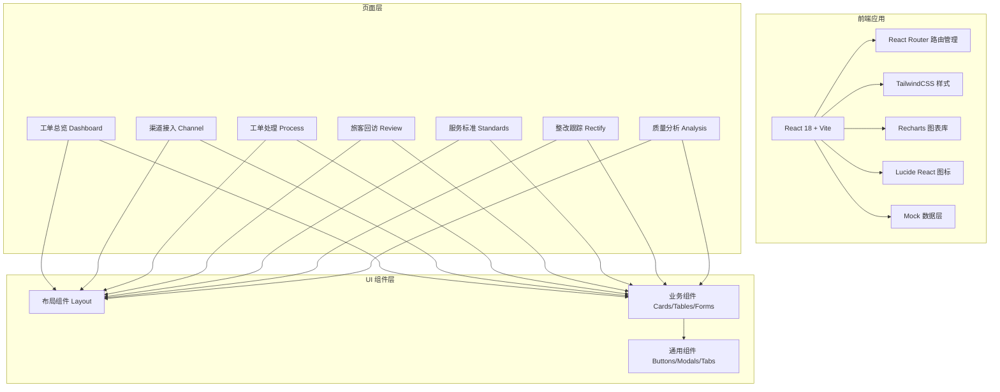
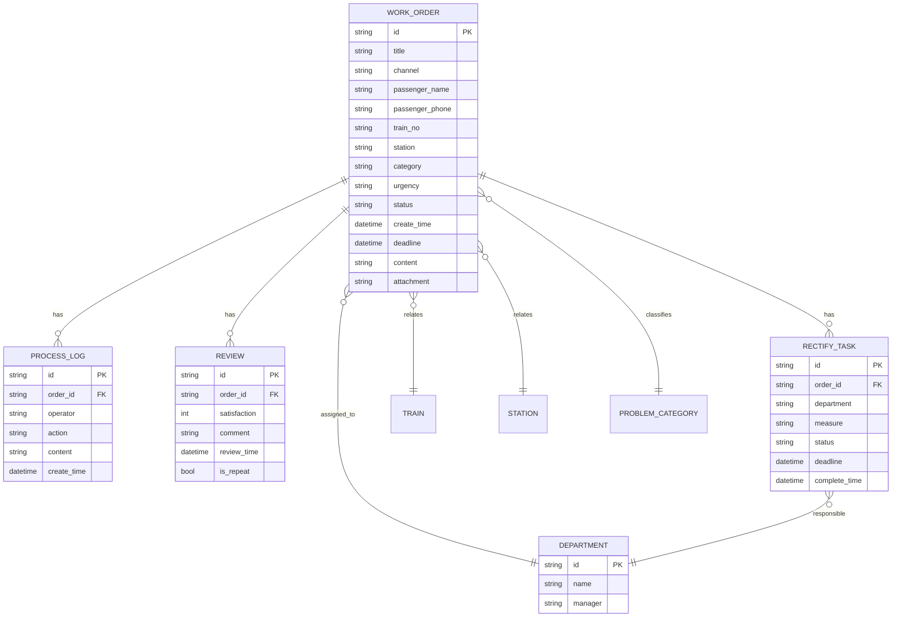

## 1. 架构设计



## 2. 技术描述

- **前端框架**：React@18 + TypeScript
- **构建工具**：Vite@5
- **样式方案**：TailwindCSS@3
- **路由管理**：React Router DOM@6
- **图表库**：Recharts@2
- **图标库**：Lucide React
- **状态管理**：React 内置 useState/useContext（轻量应用无需额外状态库）
- **数据方案**：前端 Mock 数据 + localStorage 持久化（演示用途）
- **日期处理**：date-fns

## 3. 路由定义

| 路由路径 | 页面名称 | 说明 |
|----------|----------|------|
| / | 工单总览 | 默认首页，数据看板和工单概览 |
| /channel | 渠道接入 | 工单录入、多渠道接入管理 |
| /process | 工单处理 | 工单列表、分派、处理 |
| /review | 旅客回访 | 回访记录、满意度统计 |
| /standards | 服务标准 | 标准查询、知识库 |
| /rectify | 整改跟踪 | 整改任务、责任确认 |
| /analysis | 质量分析 | 热点排行、月度报告 |

## 4. 数据模型

### 4.1 实体关系



### 4.2 数据字典

工单状态：pending(待受理), assigned(已分派), processing(处理中), replied(已答复), closed(已关闭)
紧急程度：normal(一般), urgent(紧急), critical(特急)
工单渠道：hotline(热线), web(网页), wechat(微信), app(APP)
满意度：5(非常满意), 4(满意), 3(一般), 2(不满意), 1(非常不满意)

## 5. 目录结构

```
src/
├── components/          # 通用组件
│   ├── Layout/         # 布局组件
│   ├── common/         # 通用UI组件
│   └── business/       # 业务组件
├── pages/              # 页面组件
│   ├── Dashboard/
│   ├── Channel/
│   ├── Process/
│   ├── Review/
│   ├── Standards/
│   ├── Rectify/
│   └── Analysis/
├── data/               # Mock 数据
├── types/              # TypeScript 类型定义
├── utils/              # 工具函数
├── App.tsx
├── main.tsx
└── index.css
```
